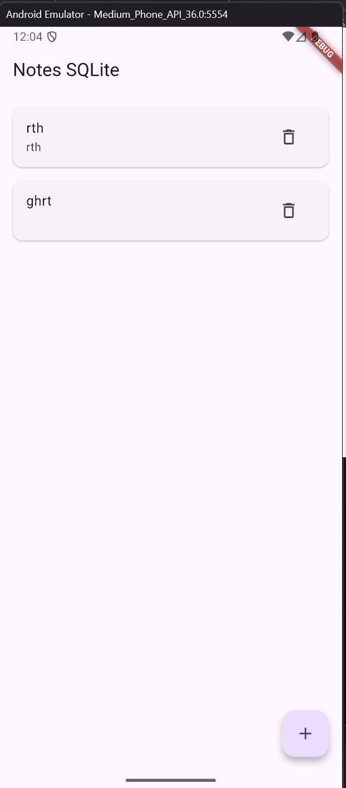

# 📝 Notes SQLite App - Flutter Приложение для заметок


Простое приложение для управления заметками с локальным хранением данных в SQLite базе данных.

## 🚀 Функциональность

- ✅ **CRUD операции**: Создание, чтение, обновление, удаление заметок
- ✅ **Локальное хранение**: Данные сохраняются в SQLite базе
- ✅ **Сортировка**: Автоматическая сортировка по дате создания (новые сверху)
- ✅ **Поиск**: Быстрый доступ к заметкам
- ✅ **Адаптивный UI**: Красивый и интуитивно понятный интерфейс
- ✅ **Поддержка свайпов**: Удаление заметок свайпом

## 📸 Скриншоты

### 📱 Главный экран (пустой список)


### ➕ Добавление новой заметки


### ✏️ Редактирование заметки


### 🗑️ Удаление заметки


## 🛠️ Технологии

- **Flutter 3.16** - Фреймворк для кроссплатформенной разработки
- **Dart 3.2** - Язык программирования
- **SQLite** - Локальная база данных
- **sqflite 2.3.3** - Плагин для работы с SQLite
- **path_provider 2.1.4** - Работа с файловой системой

## 📁 Структура проекта
lib/
├── main.dart # Точка входа приложения
├── models/
│ └── note.dart # Модель данных заметки
├── data/
│ └── db_helper.dart # Работа с базой данных
└── pages/
└── notes_page.dart # Главный экран с заметками

text

## ⚙️ Установка и запуск

### 1. Клонирование репозитория
```bash
git clone https://github.com/yourusername/notes_sqlite_app.git
cd notes_sqlite_app
2. Установка зависимостей
bash
flutter pub get
3. Запуск приложения
bash
flutter run
4. Сборка релиза
bash
# Для Android
flutter build apk --release

# Для iOS
flutter build ios --release
🗄️ База данных
Структура таблицы notes
sql
CREATE TABLE notes(
    id INTEGER PRIMARY KEY AUTOINCREMENT,
    title TEXT NOT NULL,
    body TEXT NOT NULL,
    created_at INTEGER NOT NULL,
    updated_at INTEGER NOT NULL
);

CREATE INDEX idx_notes_created_at ON notes(created_at DESC);
Расположение файла БД
Android: /data/data/com.example.notes_sqlite_app/databases/app.db

iOS: В песочнице приложения

📊 CRUD операции
Create (Создание)
dart
Future<int> insertNote(Note note) {
  return db.insert('notes', note.toMap());
}
Read (Чтение)
dart
Future<List<Note>> fetchNotes() {
  return db.query('notes', orderBy: 'created_at DESC');
}
Update (Обновление)
dart
Future<int> updateNote(Note note) {
  return db.update(
    'notes',
    note.toMap(),
    where: 'id = ?',
    whereArgs: [note.id],
  );
}
Delete (Удаление)
dart
Future<int> deleteNote(int id) {
  return db.delete(
    'notes',
    where: 'id = ?',
    whereArgs: [id],
  );
}
🎨 Особенности UI
Основные компоненты:
AppBar - Заголовок приложения

FloatingActionButton - Кнопка добавления новой заметки

ListView - Список заметок

Card + ListTile - Отображение каждой заметки

AlertDialog - Диалоги для создания/редактирования

SnackBar - Уведомления об операциях

Навигация:
Тап по заметке → Редактирование

Иконка корзины → Удаление

Свайп влево/вправо → Удаление

🔧 Миграции базы данных
dart
static const _dbVersion = 1;

onUpgrade: (db, oldVersion, newVersion) async {
  if (oldVersion < 2) {
    // Пример миграции для версии 2
    await db.execute('ALTER TABLE notes ADD COLUMN color INTEGER DEFAULT 0');
  }
}
```

